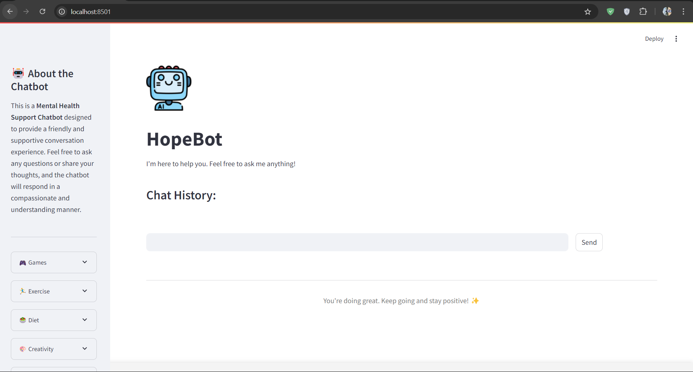
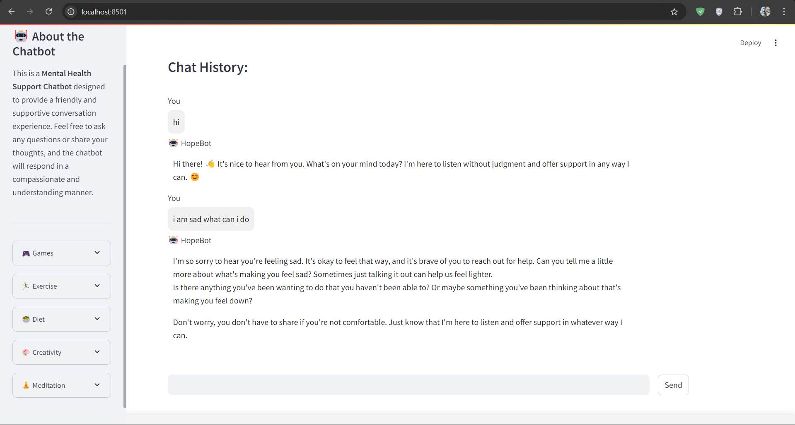

# 🌟 HopeBot: Mental Health Support Chatbot 💖

## 📖 Overview
**HopeBot** is a friendly mental health support chatbot designed to engage in compassionate and understanding conversations. Whether you need advice, a listening ear, or some uplifting words, HopeBot is here to help! 💬❤️

## 🌐 Live Demo
Experience the magic! Check out the live version of the project at: [HopeBot](https://hopebot.streamlit.app/) 🤖

Note: This project utilizes the Google Gemini API. The provided demo may no longer function, as the free trial period has expired. To clone and work with this project, please create your own Google Cloud account and obtain an API key.

## 📸 Screenshots



## 🚀 Features
- 🤖 **Interactive Chat**: Engage in real-time conversations.
- 🎮 **Fun Suggestions**: Explore games, exercises, diet tips, creativity boosts, and meditation practices.
- 💡 **Personalized Responses**: Conversations that feel warm and human.

## 🛠️ Technologies Used
- **Python**: The programming language powering the app.
- **Streamlit**: A framework for building web applications quickly.
- **Google Generative AI**: Powers the chatbot's conversational abilities.
- **HTML/CSS**: Enhances the user interface with custom styling.

## 📦 Installation

### Prerequisites
- **Python 3.7+**: Ensure you have Python installed.
- **pip**: Python package installer.

### Clone the Repository
```bash
git clone https://github.com/yourusername/your-repo-name.git
```
```bash
cd your-repo-name
```
### Install Dependencies
```bash
pip install -r requirements.txt
```
### Set Up Environment Variables
```bash
GEMINI_API_KEY=your_actual_api_key
```
### 🏃 Running the Application
```bash
streamlit run app.py
```
